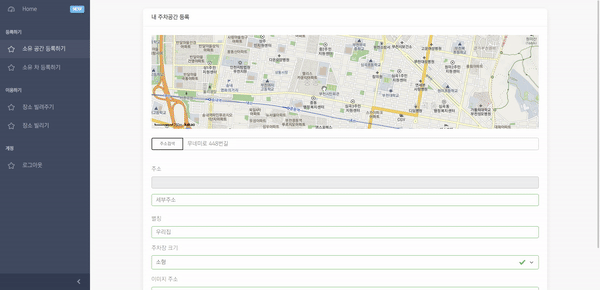
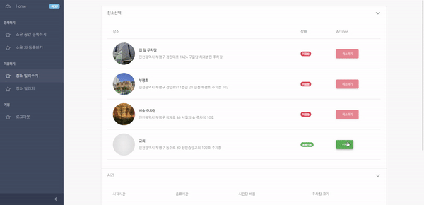

# 주차장 대여 대출 서비스 

<hr/>

### [BE : ing9990](https://github.com/ing9990/EveryParking)
### [FE : NYH0227](https://github.com/NYH0227/everyparking-frontend)
<hr/>

- ## 내 정보

```

개인정보 수정

현재 대출한 주차장 표시

다른 유저가 사용한 나의 주차장 내역 표시


```


- ## 내 주차장 등록하기
```

카카오맵 Api를 사용한 주소 찾기

```

- ## 내 주변 주차장 찾기
```

주차장 추천 기능

주변 주차장 마커 기능
현재 위치와 주차장 위치 직선거리 계산
```

- ## 주차장 대여 및 취소
```

등록한 주차장을 빌려주기
다른 사람이 대여하기 전에 취소 가능

```


---

# 사용한 Stack

---
<div>


</div>


---
# 사용한 라이브러리

## 지도
```
카카오 맵
```

## 디자인
```
coureui template
mdbootstrap

```

